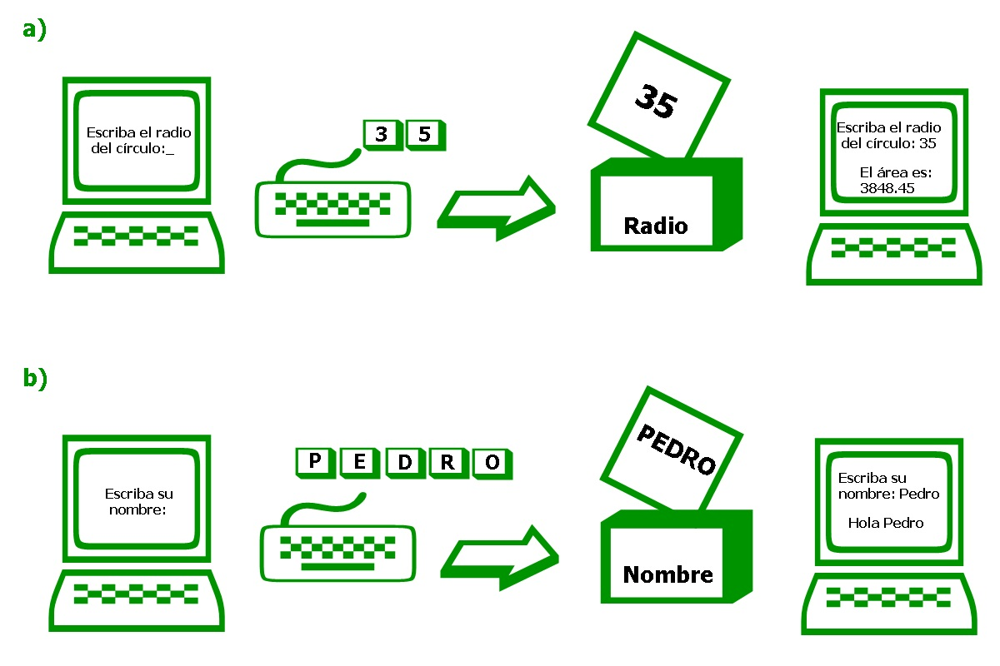

# RUTINAS DE ENTRADA O DE SALIDA

Las **rutinas de entrada o salida** de datos son instrucciones que le permiten al programa comunicarse con el usuario mediante la instrucción de información o el envío de resultados.

## Rutina de salida

La instrucción que permite escribir datos y mensajes en la pantalla es **WRITE** con su variante **WRITELN**.    

Para utilizar  **WRITE** tenga en cuenta los siguientes puntos:

1. Los textos (o mensajes) deberán ir entrecomillados.
2. Para escribir el valor almacenado en una varaiable basta con colocar el identificador correspondiente (sin comillas).
3. Para imprimir, con una misma instrucción **WRITE**, mensajes y variables, o varias variables, separar con comas (,).
4. Para imprimir un dato y bajar el cursor a la siguiente línea use **WRITELN**.

A continuación un ejemplo del uso de **WRITE** y **WRITELN**.

```pascal
    Program EjemplosDeImpresion;
    Var
        A : Integer;
    Begin
        A := 10;
        Write ('Hola');
        Write (6 * 5);
        Write (A); 
        Write ('Resultado: ', 2 * A);
    End.
```

El programa anterior imprimirá:

    Hola3010Resultado: 20

Para evitar que todas las impresiones aparezcan juntas podemos modificar el programa de la siguiente forma:


```pascal
    Program EjemplosDeImpresion_II;
    Var
        A : Integer:
        Begin
        A := 10;
        WriteLn ('Hola');
        WriteLn (6 * 5);
        WriteLn (A);
        WriteLn ('Resultado: ', 2 * A);
    End.
```

El programa anterior imprimirá:

        Hola
         30
         10
    Resultado: 20


## Salida formateada

Se conoce como *formato de salida* al aspecto que presentarán los datos una vez impresos. En Pascal hay dos posibilidades de modificación: alterar la cantidad de decimales de un número real o la cantidad de espacio mínimo para escribir todas las cifras de un número o los símbolos de una cadena.

Este control se logra agregando el modificador dos puntos (**:**) a los datos que imprimirá la instrucción **WRITE**.


### * Formateo de campos decimales

Este formateo permite controlar la cantidad de cifras decimales con las que un número será desplegado en pantalla. Ejemplo:


```pascal
    Program FormateoDecimal;
    Var
        r : Real;
    Begin
        r := 5.715;
        writeln (r:0:0);    { ===> 6 }
        writeln (r:0:1);    { ===> 5.7 }
        writeln (r:0:2);    { ===> 5.71 }
        writeln (r:0:3);    { ===> 5.715 }
        writeln (r:0:4);    { ===> 5.7150 }
    End.
```


A continuación un ejemplo de un caso común donde apreciamos la necesidad de formatear la impresión de números.


```pascal
    Program AreaDelCirculo;
    { Este programa calcula el área de un círculo de radio 35 }
    Var
        Area, Radio: Real;
    Begin
        Radio := 35;
        Area := PI * Radio * Radio; { PI es una constante predifinida }
        Write (Area);   { Cuyo valor es de 3.14159... }
    End.
```

El programa anterior escribirá: 

    3.848445100E03 


Este mismo programa imprimirá algo más legible si lo modificamos. Ejemplo:


```pascal
    Program AreaDelCirculo_II;
    Var
        Area, Radio : Real;
    Begin
        Radio := 35;
        Area := PI * Radio * Radio;
        Write (Area:0:2);
    End.
```


El programa anterior escribirá:

    3848.45

### * Formateo de campos enteros

Este formateo permite controlar el espacio necesario para las cifras enteras de un número que será desplegado en pantalla. Ejemplo:

```pascal
    Program FormateoEntero;
    Var
        r : Real;
    Begin
        r := 5.715;
        writeln (r:0:2);    { ===> 5.71 }
        writeln (r:4:2);    { ===> 5.71 }
        writeln (r:5:2);    { ===>  5.71 }
        writeln (r:6:2);    { ===>   5.71 }
        writeln (r:7:2);    { ===>    5.71 }
    End.
```

Este formateo es muy útil para impresión de tablas de datos.

### * Formateo de campos para cadenas

Este formateo permite controlar el espacio mínimo necesario para desplegar en la pantalla los caracteres de una cadena. Ejemplo:

```pascal
    Program FormateoCadena;
    Var
        st : String;
    Begin
        st := 'HOLA';
        writeln (st:3);         { ===> HOLA }
        writeln (st:4);         { ===> HOLA }
        writeln (st:5);         { ===>  HOLA }
        writeln (st:6);         { ===>   HOLA }
        writeln (st:7);         { ===>    HOLA }
        writeln ('ADIOS':6);    { ===>  ADIOS }
    End.
```

## Rutinas de entrada

La instrucción que permite recibir datos desde el teclado es **READ** con su variante **READLN**.

La instrucción **READ** suspenderá la ejecución del programa y esperará a que el usuario teclee un valor y luego oprima la tecla **ENTER**. El valor que se introduzca será almacenado en una variable. Por ejemplo: **READ (numero);**

Para utilizar **READ** tenga en cuenta los siguientes puntos:

1. El valor introducido y la variable deberán ser del mismo tipo.
2. No pueden ir comillas (mensajes) en el interior de los paréntesis.
3. Ocupa **READLN** siempre que la variable sea de tipo **STRING**.
4. Se recomienda sólo leer una variable por cada **READ**, aunque es posible leer varias variables separadas por comas.
5. Es muy conveniente enviar un mensaje (con **WRITE**) antes de hacer un **READ**, esto sirve para indicar qué tipo de información se solicita.

Ejemplo: Dos programas con el uso de READ.

```pascal
    Program AreaDelCirculo_III;
    { Este programa calcula el área
    de un círculo de radio variable }
    Var
        Area, Radio : Real;
    Begin
        Write ('Escriba el radio del círculo: ');
        Read (Radio);
        Area := PI * Radio * Radio;
        Write ('El área es ', Area:0:2);
    End.
```

Al ejecutarse este programa deberemos introducir algún número. Para este ejemplo se eligió un radio de 35, por lo que en la pantalla observará lo siguiente:

    Escriba el radio del círculo: 35
            El área es 3848.45



```pascal
    Program Saludo;
    Var
        Nombre : String;
    Begin
        WriteLn ('Escriba su nombre: ');
        ReadLn (Nombre);
        WriteLn ('Hola ', Nombre);
    End.
```

Al ejecutarse este programa deberemos introducir algún nombre. Para este ejemplo se eligió 'Pedro'. En la pantalla se observará lo siguiente:

    Escriba su nombre:
        Pedro
     Hola Pedro